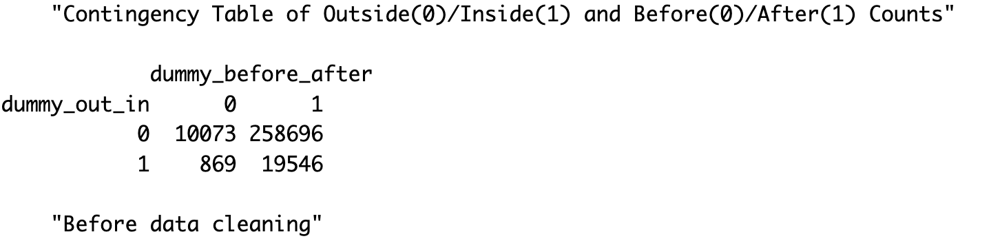
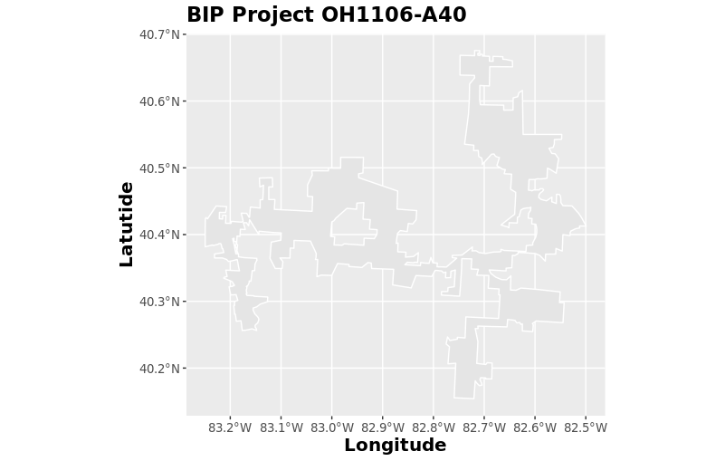
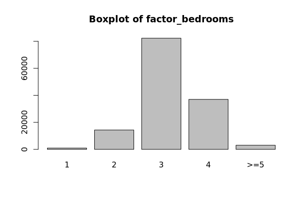
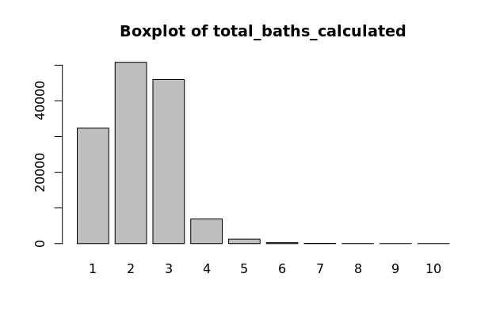
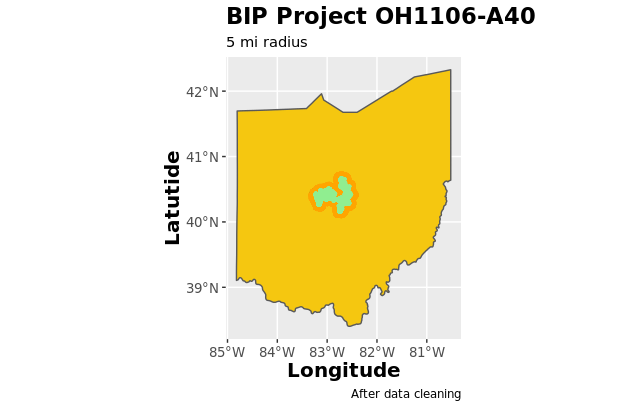

[Federal RePORTER](https://wayback.archive-it.org/18816/20220223125200/https:/federalreporter.nih.gov/FileDownload)

# Literature Review
We conducted a literature review of journals that analyzed the effects of high-speed internet access and property prices.

####Home Is Where the Internet Is? High-speed Internet’s Impact on Rural Housing Values
#####Kelsey L. Conley and Brian E. Whitacre
This report uses data from the National Broadband Map, the Federal Communications Commission, and over 2,700 housing transactions from June 2011 to June 2017 to examine the impact of broadband availability on housing values in two rural Oklahoma counties via a hedonic price model. The results find no support for the existence of a broadband premium, and stress that differences across counties are crucial in assessing rural housing prices. The full report can be found at [this link](https://doi.org/10.1177/0160017620918652).

#### High-speed Internet access and housing values
#####Gabor Molnar, Scott J. Savage, and Douglas C. Sicker
This report uses a hedonic regression model that relates house values to high-speed Internet access while controlling for the potential endogeneity of Internet access. Results show that single-family homes with access to a 25 Mbps broadband connection have a price that is about \$5,977, or 3%, more than similar homes in neighborhoods with 1 Mbps. The rural premium is lower at \$5,099. The full report can be found at [this link](https://doi.org/10.1080/00036846.2019.1631443).

# Exploratory Data Analysis of CoreLogic Property Tax Data


### Sales Price vs Assessed Price Correlation
x

# Project Area Selection
t

The BIP projects shown below represent a subset of the 132 BIP projects for which the data was 

The CoreLogic data

---
Counts of Properties In/Out Project Area and Before/After Project Implementation
---
```{r}
state8_counts <- read.csv("www/state8_counts")
state8_counts[,2:8]
```
{width=80%}</center> 

{width=80%}</right> 
{width=80%}</right> 

# Model

### Data Cleaning


### Variable Selection

### Variable Manipulation

#### Dummy Variables


#### Factor Variables
{width=45%}</left>  {width=45%}</right>
{width=45%}</left>  {width=45%}</right>
{width=45%}</left>  {width=45%}</right>
{width=45%}</left>  {width=45%}</right>

### Final Model
{width=80%}</center> 
{width=80%}</right> 

### Conclusion
x
