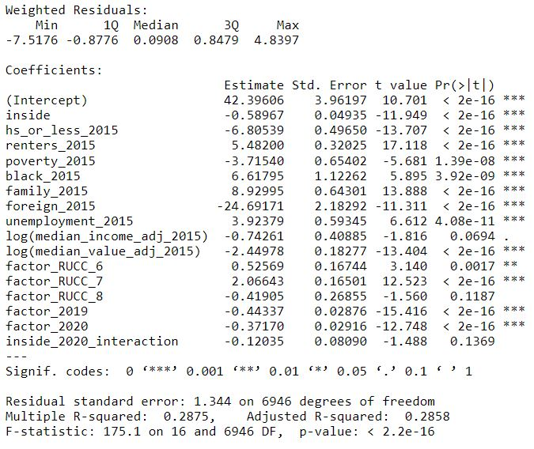
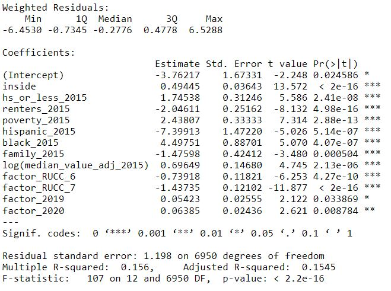

# Exploratory Data Analysis
In order to determine which project area we would analyze, we looked at the number of Ookla observations for some of the most populous project areas funded in 2017, and used the region with the most consistently high counts of Ookla tests in order to ensure we had a sample size large enough to proceed. The reason we chose 2017 as the year of funding was to increase the probability that the project was in the process of being implemented between the years over which Ookla data was collected.
 
{width=45%}
  
{width=45%}
  
{width=45%}
  
 

# Variable Selection and Methods
Three linear models were created; one for each of download speeds, upload speeds, and latency periods. For each, we looked at the log of the value in order to correct for right-skewed data. In addition to time, proportion of the Ookla tile in the project area, and the interaction between the two, we also included various tract level demographic data which had potential to influence internet speeds in the area, such as median income. 
 
All tract level data was pulled from the American Community Survey for the year 2015 to ensure the data was collected before the infrastructure grant had the opportunity to affect such demographics. After potential variables of interest were identified, a step function utilizing AIC was implemented to bring out only the most significant variables. 

# Models

## Model for Download Speeds 
{width=50%}
  
 

## Model for Upload Speeds 
{width=50%}
  
 

## Model For Latency
{width=50%}
  

# Conclusion
x

